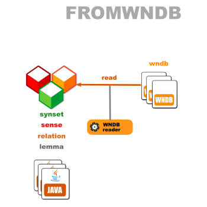

  

  

# OEWN model-from-WNDB

This reads a model from WNDB files.

Project [fromwndb](https://github.com/oewntk/fromwndb)

## Dataflow

## Maven Central

		<groupId>io.github.oewntk</groupId>
		<artifactId>fromwndb</artifactId>
		<version>3.0.1</version>
